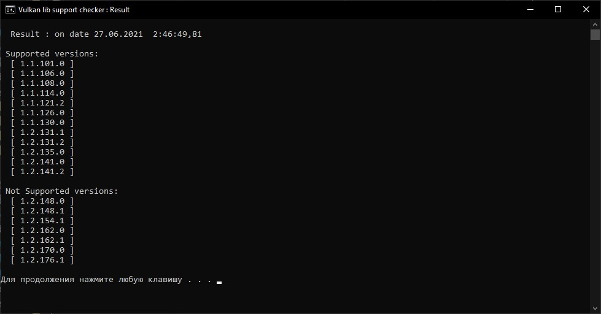

# vulkan_support_check_fix_win
This script will show you which versions of Vulkan API your device is compatible with. (script, windows)

## Instruction for support check

- run **vlk_support_check.bat**
- see which versions of Vulkan API your device is compatible, or not
- be happy :)

*that’s about to work out...*
 

## Instruction for force install

- run **vlk_force_install.bat** (with Administrator rights)
- enter Vulkan version (e.g. 1.2.162.0)
- press "Enter"
- wait for the installation to finish
- be happy :)